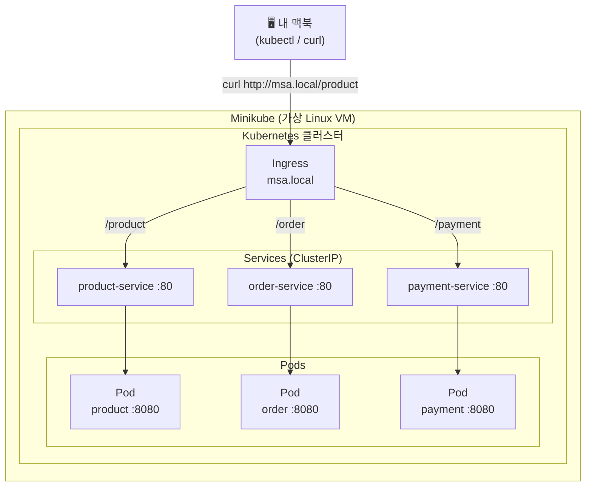

# MSA K8s Deploy Template

Kotlin + Spring Boot + Testcontainers + Docker + Kubernetes를 활용한 MSA 템플릿 프로젝트입니다.

> 상세 실행 가이드는 [GETTING_STARTED_v1.0.md](./GETTING_STARTED_v1.0.md)를 참고하세요.

## 기술 스택

| 항목 | 버전 |
|------|------|
| Language | Kotlin 1.9.25 |
| Framework | Spring Boot 3.4.10 |
| Java | OpenJDK 21 |
| Build | Gradle 8.x (Multi-Module) |
| Testing | Testcontainers 1.20.3 (Redis) |
| Container | Docker |
| Orchestration | Kubernetes (Minikube) |

## 프로젝트 구조

```
local_msa_minikube_deploy/
├── product-service/              # 상품 서비스 (host: 8081)
│   ├── src/
│   └── Dockerfile
├── order-service/                # 주문 서비스 (host: 8082)
│   ├── src/
│   └── Dockerfile
├── payment-service/              # 결제 서비스 (host: 8083)
│   ├── src/
│   └── Dockerfile
├── k8s/                          # Kubernetes 매니페스트
│   ├── product-deployment.yaml
│   ├── order-deployment.yaml
│   ├── payment-deployment.yaml
│   ├── service.yaml              # ClusterIP 서비스 3개
│   └── ingress.yaml              # msa.local 진입점
├── docker-compose.yml
├── build.gradle.kts              # 루트 공통 설정
├── settings.gradle.kts
└── GETTING_STARTED_v1.0.md       # 단계별 실행 가이드
```

## API 엔드포인트

모든 서비스는 동일한 구조로 구현되어 있습니다.

| Method | Path | 설명 |
|--------|------|------|
| GET | `/` | 서비스 상태 메시지 |
| GET | `/products` `/orders` `/payments` | 목록 조회 |
| GET | `/health` | 헬스체크 |

## 아키텍처



> **Ingress** — 외부 요청을 받는 라우터 (msa.local 도메인)  
> **Service** — Pod 앞단의 고정 주소 (Pod IP가 바뀌어도 서비스 이름은 유지)  
> **Pod** — Spring Boot 앱이 실제로 돌아가는 컨테이너 단위

## 실행 방법

### Level 1 — 로컬 직접 실행

```bash
# 빌드 (테스트 제외)
./gradlew clean build -x test

# 각 터미널에서 개별 실행
./gradlew :product-service:bootRun --args='--server.port=8081'
./gradlew :order-service:bootRun --args='--server.port=8082'
./gradlew :payment-service:bootRun --args='--server.port=8083'
```

접속 확인:
```bash
curl http://localhost:8081/products
curl http://localhost:8082/orders
curl http://localhost:8083/payments
```

### Level 2 — Testcontainers 테스트

Docker Desktop이 실행 중이어야 합니다.

```bash
# 전체 테스트
./gradlew test

# Testcontainers 테스트만
./gradlew :product-service:test --tests "*ContainerTest"
./gradlew :order-service:test --tests "*ContainerTest"
./gradlew :payment-service:test --tests "*ContainerTest"
```

### Level 3 — Docker Compose

```bash
# 이미지 빌드 후 실행 (product: 8081, order: 8082, payment: 8083)
docker-compose up -d

# 로그 확인
docker-compose logs -f

# 정리
docker-compose down
```

### Level 4 — Kubernetes (Minikube)

```bash
# 1. Minikube 시작 및 ingress 활성화
minikube start
minikube addons enable ingress

# 2. Minikube 내부 Docker 환경으로 전환
eval $(minikube docker-env)

# 3. 각 서비스 JAR 빌드 후 이미지 빌드
./gradlew :product-service:bootJar
./gradlew :order-service:bootJar
./gradlew :payment-service:bootJar

cd product-service && docker build -t product:latest . && cd ..
cd order-service && docker build -t order:latest . && cd ..
cd payment-service && docker build -t payment:latest . && cd ..

# 4. 배포
kubectl apply -f k8s/

# 5. 상태 확인
kubectl get pods
kubectl get services
kubectl get ingress
```

로컬 접근 설정:
```bash
# /etc/hosts에 추가
echo "$(minikube ip) msa.local" | sudo tee -a /etc/hosts

# 접속 테스트
curl http://msa.local/product
curl http://msa.local/order
curl http://msa.local/payment
```

정리:
```bash
kubectl delete -f k8s/
minikube stop
```

## 트러블슈팅

| 증상 | 원인 | 해결 |
|------|------|------|
| `Port 8080 is already in use` | 포트 충돌 | `--args='--server.port=808x'` 로 변경 |
| `Cannot connect to the Docker daemon` | Docker 미실행 | Docker Desktop 실행 |
| `Could not find a valid Docker environment` | Testcontainers Docker 연결 실패 | Docker Desktop 실행 확인 |
| `ImagePullBackOff` | Minikube가 로컬 이미지를 찾지 못함 | `eval $(minikube docker-env)` 후 재빌드 |
